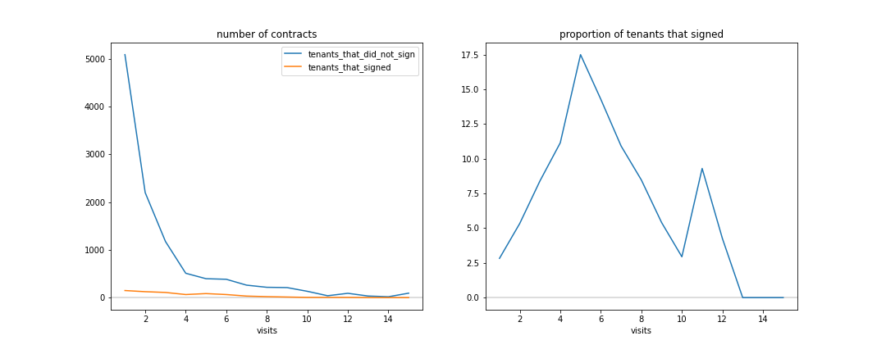
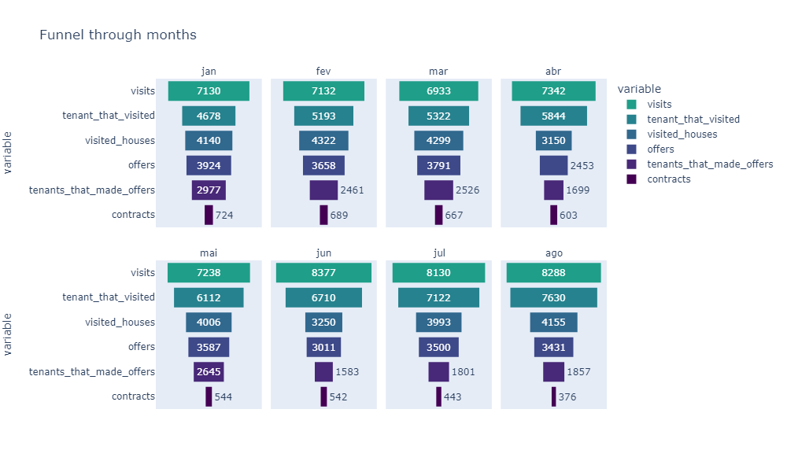
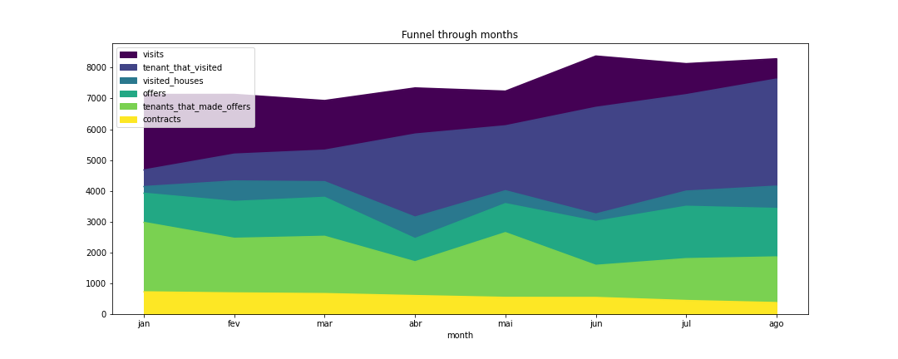
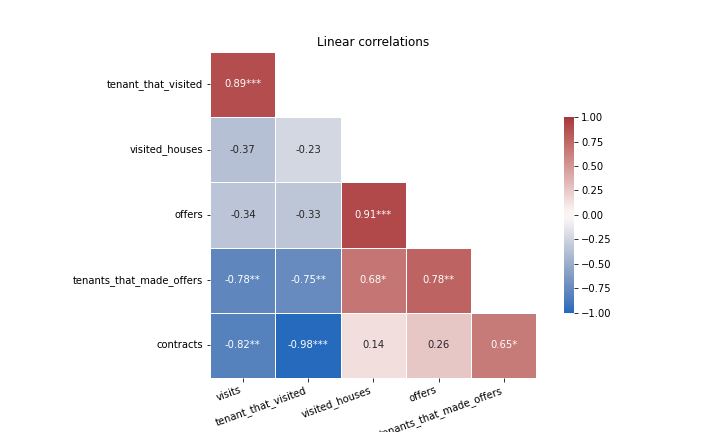
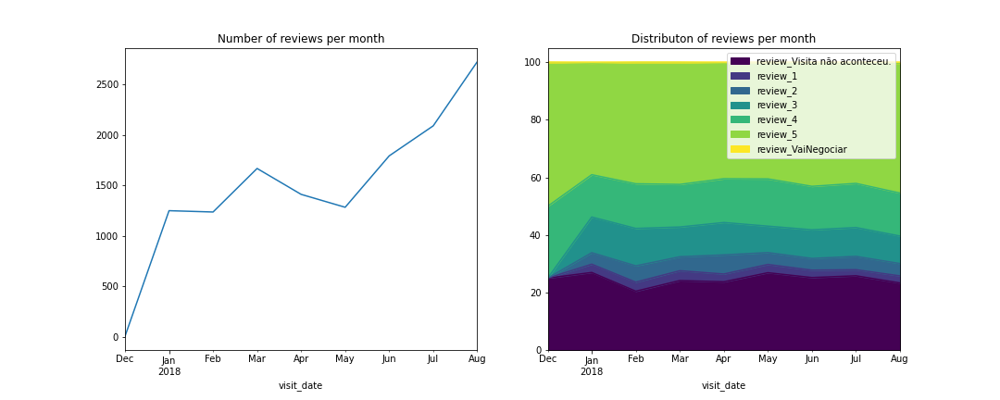
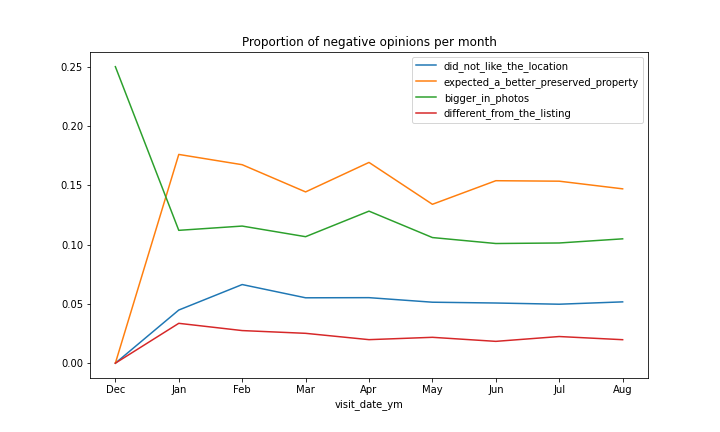

# Case

Imagine you've just been hired as a Data Analyst to join one of our Data
Squads, responsible for leveraging the products team and operation
team to make better decisions based on data and provide insights
that improve the our stakeholders decisions.

This quarter, your main goal is to help the product team to **increase
the number of contracts signed**, which **has been in steady decline** since early this year.

## What seems to be happening?

    Try to understand main bottlenecks along the funnel and raise hypotheses that may have caused each behavior.

Os dados do contratos assinados por visita sugerem que na maioria das vezes, as primeiras visitas não são convertidas em contratos assinados (Figura [01](#fig01)). Isto também é visto no funil de contratos com o **número de inquilinos que fizeram ofertas** (Figuras [02](#fig02) e [03](#fig03)). 

Talvez se os inquilinos fizessem mais visitas, aumentasse a probabilidade de fazer uma oferta e, por consequência, de assinar contrato. Uma outra possibilidade, é causar uma melhor impressão ou um melhor match nas primeiras visitas. Para isso, aumentar a verosimilhança dos anúncios pode ajudar: muitas reviews tem marcações da casa ser diferente do anúncio, não estar tão conservada e/ou ser maior nas fotos (Figura [06](#fig06)). As pessoas estão indo para a visita com expectavas diferentes do que vão encontrar. Ao mostrar anúncios que retratam melhor a condição da casa, pode resultar expectativas alinhadas nas primeiras visitas e uma maior probabilidade de fazer uma oferta e assinar contrato. 

Além disso, o **número de casas visitadas** parece ser um outro bottleneck, que limita todo o funil abaixo**: número de ofertas, de inquilinos que fizeram ofertas e, consequentemente, o número de contratos. Essa é a maior separação no gráfico de funil (Figuras [02](#fig02) e [03](#fig03)). Como isso, mesmo com as notas das visitas praticamente constantes no tempo (Figuras [05](#fig05)), o número de contratos assinados continua em queda.  
    

## Is there any other information that would be relevant to your analysis?

    Why would it be relevant? What would be the outputs with the new data available?

- Seria interessante saber quais visitas resultaram em contratos.
- Quantas visitas cada inquilino fez até aquele momento. 

Isto é, seria útil ter as outras duas tabelas na mesma granularidade da tabela de visita e chaves para conseguir combinar essas tabelas.
Com esses dados adicionais poderíamos conectar as informações das três tabelas fornecidas e fazer obter insights mais precisos e aprofundados.
   
  

## Can you think of 3 other analysis that could help our stakeholder with our quarter goal?

    Please describe the analysis as well as the benefits of each one for our stakeholders. Try to explain how the idea could be implemented, connecting strategy with product team and how these analysis can make impact in our stakeholders decisions.

- Analisar a qualidade dos anúncios e o que fazer para melhor alinhar as expectativas dos clientes na primeira visita.
- Analisar como melhorar os filtros de anúncios/recomendação de anúncios, para que o cliente consiga uma correspondência mais adequada e, assim, uma maior probabilidade de assinar contrato nas primeiras visitas.
- Analisar/entender o que faz o número de casas visitadas ser menor. Talvez, novamente, isso esteja relacionado com a qualidade dos anúncios, localidade, etc.

## Figuras

<a name="fig01">Figura 01: Número de clientes que assinaram vs não assiram (esquerda) e a proporção de clientes que assinaram (direita).</a>

<a name="fig02">Figura 02: Funil de contratação em cada mês.</a>

  
<a name="fig03">Figura 03: Evolução do funil de contratação ao longo do tempo.</a>

<a name="fig04">Figura 04: Correlações entre as variáveis do funil.</a>

<a name="fig05">Figura 05: Distribuição das Reviews ao longo dos meses.</a>

<a name="fig06">Figura 06: Proporção das opiniões negativas ao longo do tempo.</a>

